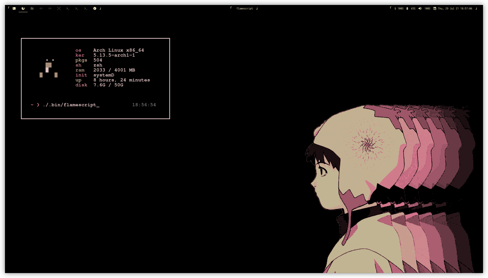

# dotfiles
My precious, litte dotfiles. Arch + Bspwm + Zsh (Prezto) etc, managed with pain.



# How to use
1. Install the programs you want
2. Clone the repo
3. Use GNU Stow to symlink the dotfiles like this:
```sh
stow . # All dotfiles
stow zsh # Add only zsh
```
4. Enjoy

PS: I will not provide any support regarding my dotfiles, if you want to use them feel free but be aware of that.
